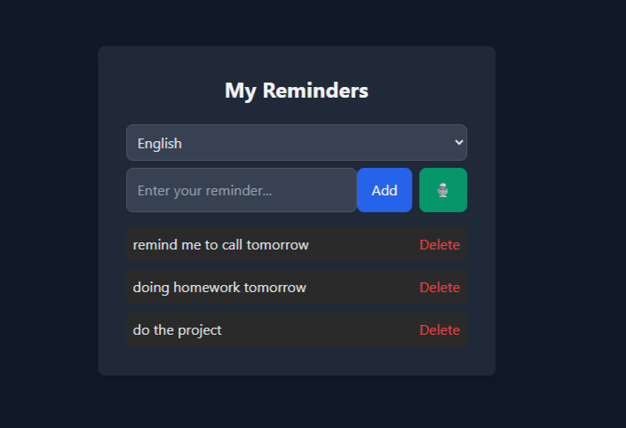

# To-Do
A website for daily activities
A smart, lightweight voice-powered reminder app built with HTML, TailwindCSS, and Vanilla JavaScript.
It supports Speech Recognition, multilingual interface (English & Persian), and localStorage for saving reminders permanently in your browser.

---

